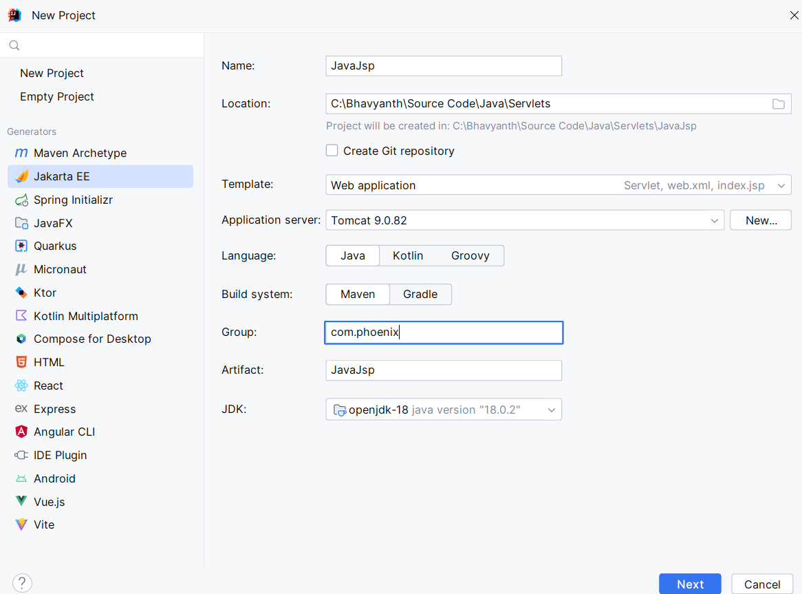

## Servlets and JSPs
### Creation of Java EE Project
- Download apache tomcat from ```https://tomcat.apache.org/download-90.cgi```
- Open Intellij 
  - New project
  - Generators as Jakarta EE
  - Provide name and location of the project 
  - Select the application server as the tomcat folder downloaded from the apache
  - Provide group and artifact ID
  - Select JDK - if not selected by default

